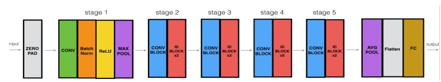
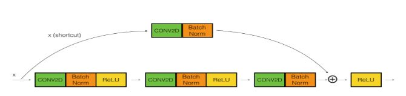

# ABE-598-Autonomous-Descion-Making
Assignments / Project

# Resnet.ipynb

A very deep convolutional network using Residual Networks.  Residual Networks, introduced by He et al., allow us to train much deeper networks than were previously practically feasible.In this code, the basic building blocks of ResNets. were implemented. The building blocks were put together and a state-of-the-art neural network for image classification was trained.

A huge barrier to training Deep Networks is vanishing gradients: very deep networks often have a gradient signal that goes to zero quickly which makes gradient descent unbearably slow. As we backpropagate from the final layer back to the first layer we are multiplying by the weight matrix on each step, and thus the gradient can decrease exponentially quickly to zero. This problem is solved by building a Residual Network!

In ResNets, a "shortcut" or a "skip connection" allows the gradient to be directly backpropagated to earlier layers

In this code we implement two types of blocks:  
Identity Block: In this the the input activation has the same dimension as the output activation. In this code the skip connection "skips over" 3 hidden layers 
Convolutional Block:This block is used when the input and output dimensions don't match up. 
